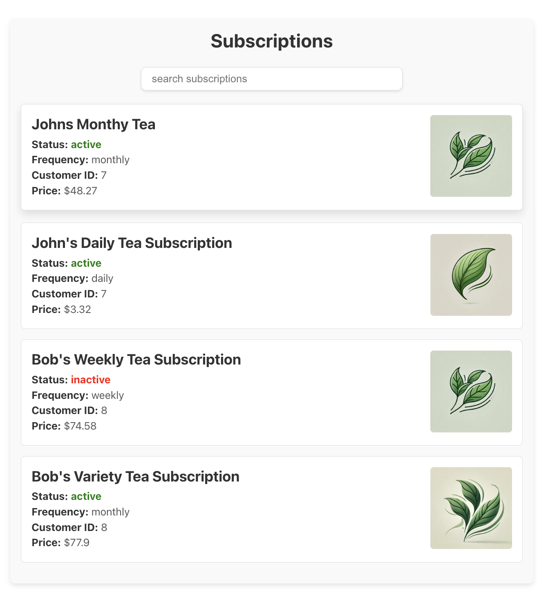
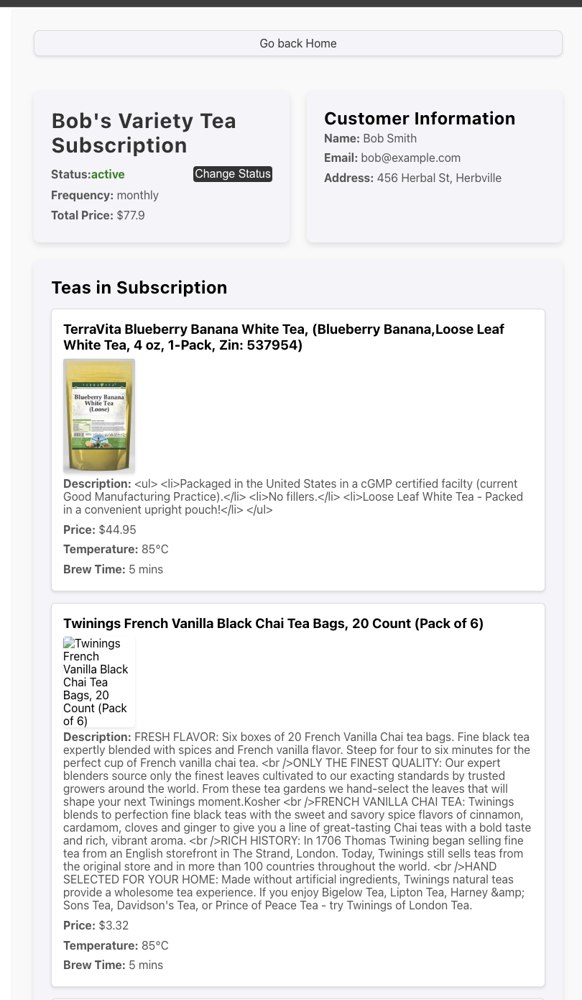

# 🍵 Tea Subscription React App

Welcome to the **Tea Subscription React App**! This project is all about simplifying your tea subscription experience, helping users explore and manage their tea selections with ease. Built to consume the Rails API you've created, this app focuses on providing a clean, intuitive, and delightful user experience.


## 🌿 Features

- **Subscription List**: A display of available subscriptions, each with its name and an inviting image/icon.
- **Detailed Subscription View**: Dive deeper into each subscription with details like:
  - Subscription name
  - Image/icon
  - Description
  - Teas and customers involved
- **Cancel Subscription Option**: Allow users to cancel individual teas or multiple teas within a subscription.
- **Search Option**: Find what you’re looking for quickly with one of these handy tools.


## 🚀 Getting Started

1. **Clone the repo**:
   ```bash
   git clone https://github.com/yourusername/tea-subscription-react-app.git
   ```
2. **Install dependencies:**
    ```
    npm install
    ```
3. **Start the app:**
    ```
      npm start
    ```
4. Connect to the Rails API: Ensure your Rails API is running and accessible to enable full functionality of the app. The api can be downloaded from this link [Rails API Backend](https://github.com/jphill19/rails-api-starter)

## 🛠Tech Stack
- React: Front-end framework
  - React Router for navigation
- Rails API: Backend service providing subscription data


## 📸 Screenshots



